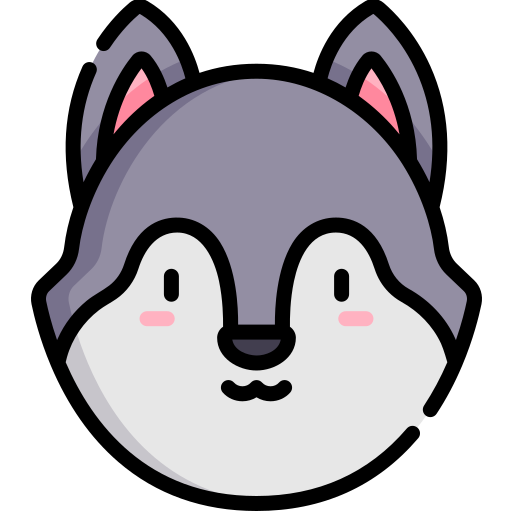
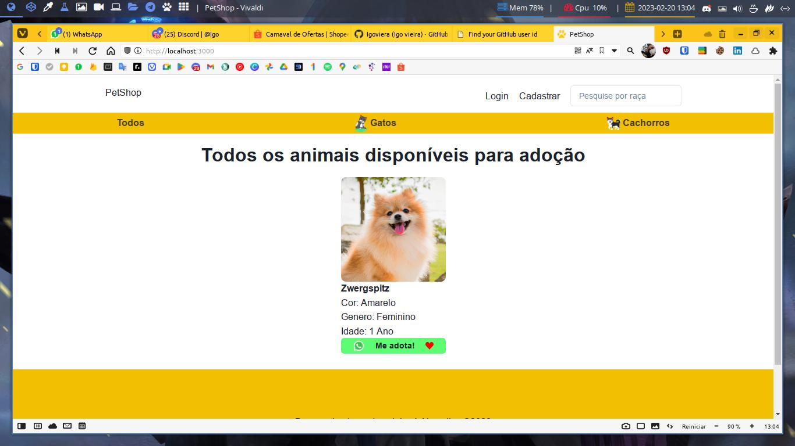

<h1 align="center">
  
</h1>

<h1 align="center"> ⭐️ CatDog App ⭐️ </h1>

## Descrição Do Projeto

descrição aqui

<h1 align="center"> ️💚️ Desenvolvedores 💚 </h1>

  | 
---|---
[Igo Viera ](https://github.com/Igoviera) |[Alan Silva](https://github.com/alansilvacode)

<!-- | [
  
   
  <b>Alan Silva</b>
](https://github.com/alansilvacode) |  -->

## Dependências Do Projeto

- [Node](https://nodejs.org/en/) = 18
- [Nvm](https://github.com/nvm-sh/nvm) = 0.39.3

